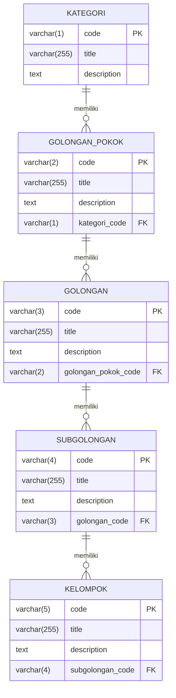

# Database KBLI 2025 (Klasifikasi Baku Lapangan Usaha Indonesia)

Database terstruktur Klasifikasi Baku Lapangan Usaha Indonesia (KBLI) tahun 2025 hasil ekstraksi dari dokumen resmi Badan Pusat Statistik (BPS) publikasi tanggal 24 Desember 2025 ([Sumber Resmi BPS](https://www.bps.go.id/id/publication/2025/12/24/a9b2f130776c7bea36008556/klasifikasi-baku-lapangan-usaha-indonesia-kbli-2025-.html)). 

Repository ini didesain dengan tingkat kompatibilitas tinggi agar data mudah dibaca dan digunakan oleh berbagai bahasa pemrograman (JS, Python, PHP, Go, C#, Java, dll.) serta framework apa pun.

## Aplikasi Pencarian & Static API

Repository ini dilengkapi dengan aplikasi web pencarian instan dan layanan static API gratis:
*   **Aplikasi Web Pencarian:** [https://tiomultazem.github.io/kbli-2025/](https://tiomultazem.github.io/kbli-2025/) (Interactive, cepat, dan mobile-friendly).
*   **Static REST API:** Seluruh file data JSON dapat diakses langsung menggunakan HTTP GET (misal: `https://tiomultazem.github.io/kbli-2025/05_kelompok.json`) untuk integrasi data instan ke aplikasi Anda tanpa perlu database backend.

## File Database yang Tersedia

Anda bisa langsung menggunakan salah satu dari opsi berikut:
1.  **Format JSON (Kompatibilitas Luas):** File `01_kategori.json`, `02_golongan_pokok.json`, `03_golongan.json`, `04_subgolongan.json`, dan `05_kelompok.json` yang terurut dan siap dibaca natively oleh semua bahasa pemrograman.
2.  **Format SQLite (Database Siap Pakai):** File `kbli_2025.db` yang sudah terisi data lengkap beserta relasi *foreign keys* yang valid. SQLite tidak memerlukan server dan bisa langsung di-embed ke aplikasi mobile/web/desktop.

---

## Struktur Data & Jumlah Item

Data dibagi menjadi 5 tingkatan relasional berdasarkan kode hierarki KBLI:

| Nama File | Level KBLI | Jumlah Item | Foreign Key Relasi |
| :--- | :--- | :--- | :--- |
| `01_kategori.json` | Kategori (1 Karakter huruf, A-V) | 22 | - |
| `02_golongan_pokok.json` | Golongan Pokok (2 Digit) | 87 | `kategori_code` |
| `03_golongan.json` | Golongan (3 Digit) | 257 | `golongan_pokok_code` |
| `04_subgolongan.json` | Subgolongan (4 Digit) | 519 | `golongan_code` |
| `05_kelompok.json` | Kelompok (5 Digit) | 1559 | `subgolongan_code` |

---

## Hubungan Antar Tabel (Entity Relationship Diagram)



---

## Panduan Impor & Skema SQL Universal

Jika Anda ingin mengimpor data ini ke server database Anda sendiri (MySQL, PostgreSQL, SQL Server), ikuti langkah-langkah berikut:

### 1. Skema DDL SQL Standar (ANSI SQL)

```sql
CREATE TABLE kategori (
    code VARCHAR(1) PRIMARY KEY,
    title VARCHAR(255) NOT NULL,
    description TEXT
);

CREATE TABLE golongan_pokok (
    code VARCHAR(2) PRIMARY KEY,
    title VARCHAR(255) NOT NULL,
    description TEXT,
    kategori_code VARCHAR(1),
    FOREIGN KEY (kategori_code) REFERENCES kategori(code) ON DELETE SET NULL
);

CREATE TABLE golongan (
    code VARCHAR(3) PRIMARY KEY,
    title VARCHAR(255) NOT NULL,
    description TEXT,
    golongan_pokok_code VARCHAR(2),
    FOREIGN KEY (golongan_pokok_code) REFERENCES golongan_pokok(code) ON DELETE SET NULL
);

CREATE TABLE subgolongan (
    code VARCHAR(4) PRIMARY KEY,
    title VARCHAR(255) NOT NULL,
    description TEXT,
    golongan_code VARCHAR(3),
    FOREIGN KEY (golongan_code) REFERENCES golongan(code) ON DELETE SET NULL
);

CREATE TABLE kelompok (
    code VARCHAR(5) PRIMARY KEY,
    title VARCHAR(255) NOT NULL,
    description TEXT,
    subgolongan_code VARCHAR(4),
    FOREIGN KEY (subgolongan_code) REFERENCES subgolongan(code) ON DELETE SET NULL
);
```

### 2. Panduan Urutan Impor (Dependency Order)
Karena adanya relasi kunci tamu (*foreign key constraints*), Anda harus mengimpor file data dengan urutan hierarki berikut:
1. `01_kategori.json`
2. `02_golongan_pokok.json`
3. `03_golongan.json`
4. `04_subgolongan.json`
5. `05_kelompok.json`

---

## Cara Membuat/Memperbarui Database SQLite

Kami menyediakan script generator database SQLite portabel bernama `build_sqlite.py` (ditulis menggunakan library Python bawaan, tanpa perlu install library tambahan).

Jalankan perintah berikut di terminal/command prompt untuk membangun ulang file `kbli_2025.db`:
```bash
python build_sqlite.py
```
Setelah script selesai berjalan, file `kbli_2025.db` akan langsung tercipta/terupdate di direktori kerja Anda.

---

## Hak Cipta & Lisensi

*   **Copyright:** &copy; 2026 Gilang Wahyu Prasetyo, BPS Kabupaten Tabalong.
*   **Lisensi:** MIT License (Khusus Penggunaan).
*   **Ketentuan Modifikasi:** Anda **tidak diperbolehkan mengubah atau mengedit dataset ini secara langsung** untuk didistribusikan ulang. Jika menemukan kesalahan data atau ingin mengajukan perubahan, Anda wajib bersurat/menghubungi **kami**. Jangan mengubah data secara mandiri.
*   **Status Data:** Data diekstraksi secara otomatis menggunakan AI dari PDF resmi KBLI 2025.

